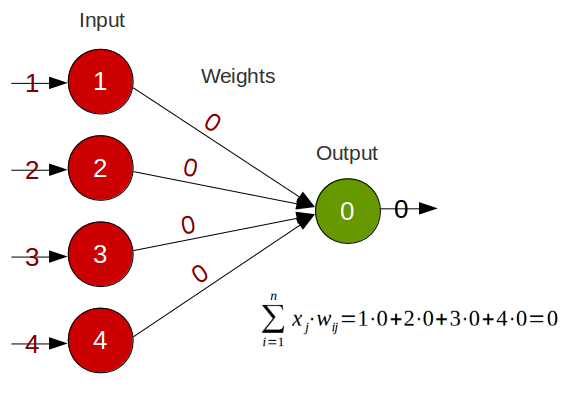

# neural-network
[](https://travis-ci.org/patrickschur/neural-network)
[](https://codecov.io/gh/patrickschur/neural-network)
[](https://packagist.org/packages/patrickschur/neural-network)
[](https://github.com/patrickschur/neural-network)
[](http://php.net/)
[](https://opensource.org/licenses/MIT)

A dead simple neural network. For educational purposes only. Ported from Java into PHP.
Originally written in Java from [Brotcrunsher](https://youtube.com/brotcrunsher) a German youtuber who makes tutorials about computer science.

> **Note**: The project is still under construction and can change at any time

## Installation
```bash
$ composer require patrickschur/neural-network
```

## Examples
Creating a simple single-layer perceptron network with four inputs and one output neuron.
```php
// Creates the neural network
$nn = new NeuralNetwork();
 
// Creates four input neurons
$i1 = $nn->createNewInput();
$i2 = $nn->createNewInput();
$i3 = $nn->createNewInput();
$i4 = $nn->createNewInput();
 
// Sets the input for each input neuron
$i1->setValue(1);
$i2->setValue(2);
$i3->setValue(3);
$i4->setValue(4);
 
// Creates the output neuron
$o1 = $nn->createNewOutput();
 
// Sets the weights and connect each input to the output neuron
$nn->createFullMesh(0, 0, 0, 0);
 
echo $o1->getValue(); // Output 0
```


## Contribute
Feel free to contribute. Any help is welcome.

## License
This project is licensed under the terms of the MIT license.